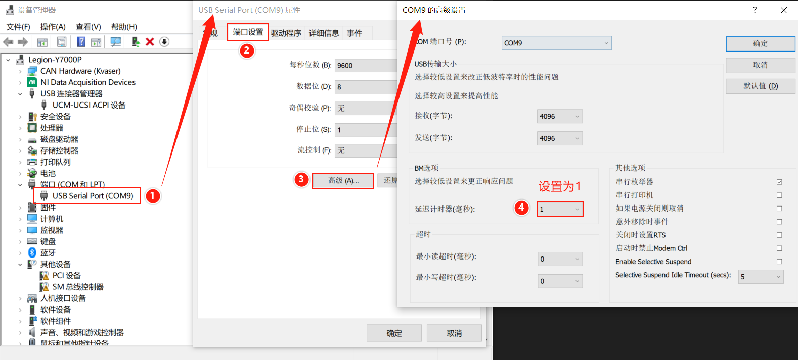

# Unitree-GO_M8010_6-Motor
1. 该说明主要针对Windows Matlab Simulink平台
2. 主程序为./src/Motor.slx，启动前最好运行init.m回到初始位置

## CRC校验

./src/CRC文件夹中crc_ccitt为官方给出的C程序，generateCRC为据此改写的matlab程序

## COM模块

./src/COM文件夹中为simulink串口通信模块的实现，同串口双电机，但丢包率较高

## Real-Time模块

./src/Real-Time文件夹中为simulink Real-Time模块的双串口双电机实现，没有收发时序控制，加入传感器模块后会有粘包情况，加入缓冲区处理环节仍不理想。

## C-mex

./src/C-mex文件夹中使用C-mex S-function实现双电机时序控制，在1kHz通讯频率及Real-Time下程序鲁棒

```shell
mex motor0.c
mex motor1.c
```

需要对每个串口在设备管理器中设置端口延迟，否则无法1kHz实时


